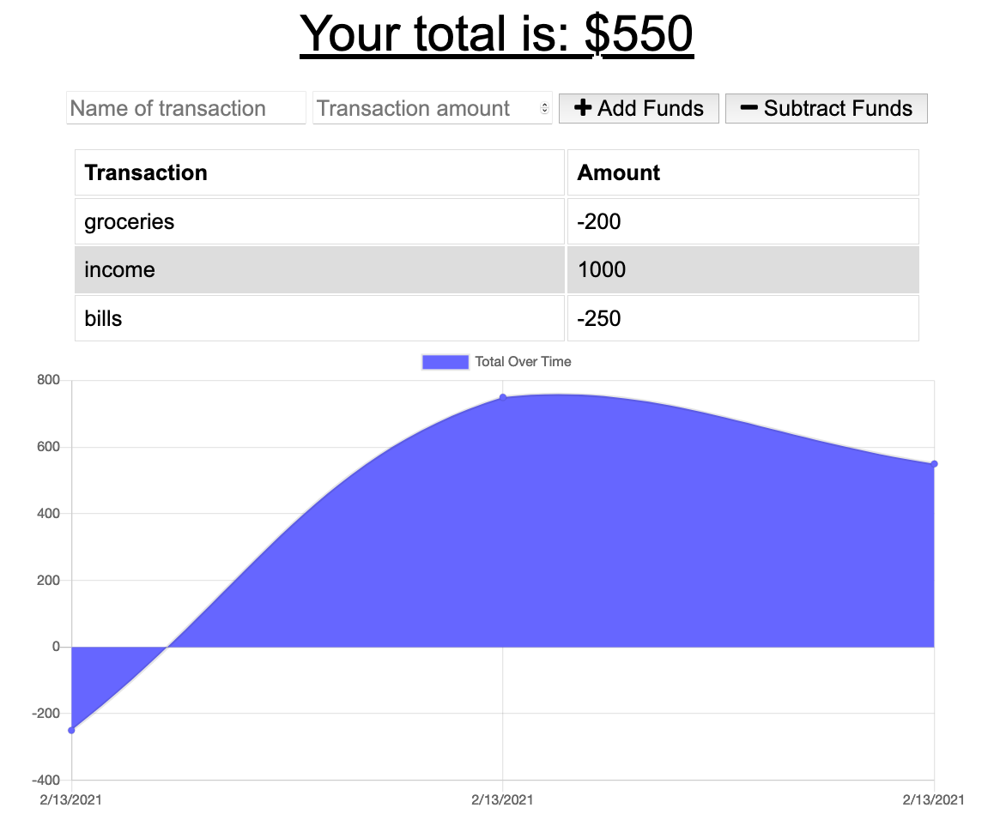
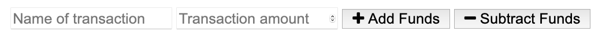
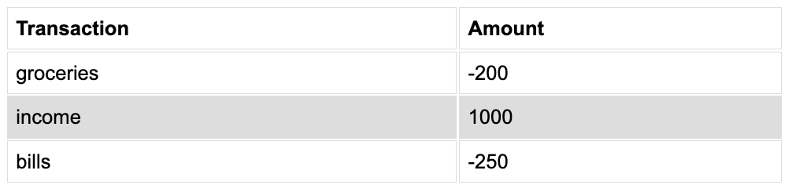
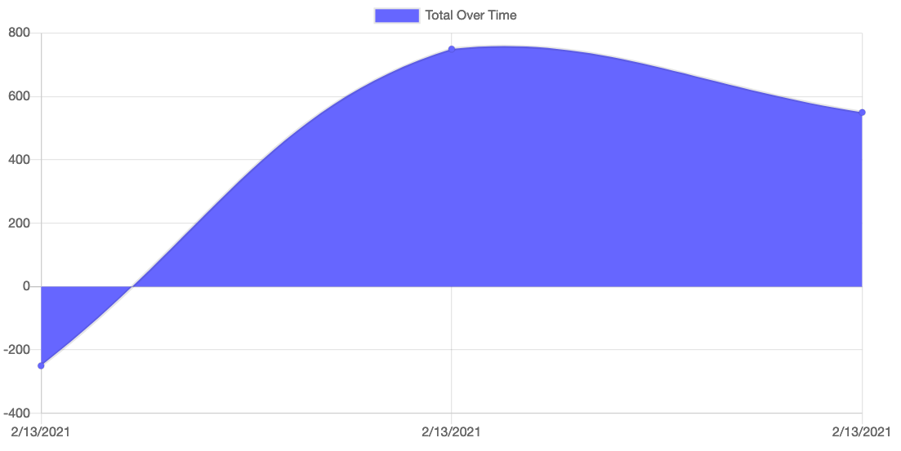

# pwa-budget-tracker

## Description

This is a budget tracker application that allows the user to keep track of transactions at home or abroad. The significant advantage that comes to using this app as opposed to other budget apps is that it allows offline functionality. Consequently, if you find yourself in a location that does not have internet access, you can still continue to keep track of your expenses throughout the entire trip. Once you find an internet connection all of the information will be saved.

https://secure-ocean-04930.herokuapp.com/

## Installation

To use this repository you will need Node, express, and a mongoose database.

## Usage

To initiate the application type 'npm start' in the terminal and open the respective PORT in your web browser.

To use the application enter the name of the transation, the amount of that transaction, and whether it was money that you spent or money that you deposited.

The transactions will be listed underneath the input field.

A graph will also be created showing your spending habits over time.

### Things I learned

- Lighthouse
- PWA
- App performance
